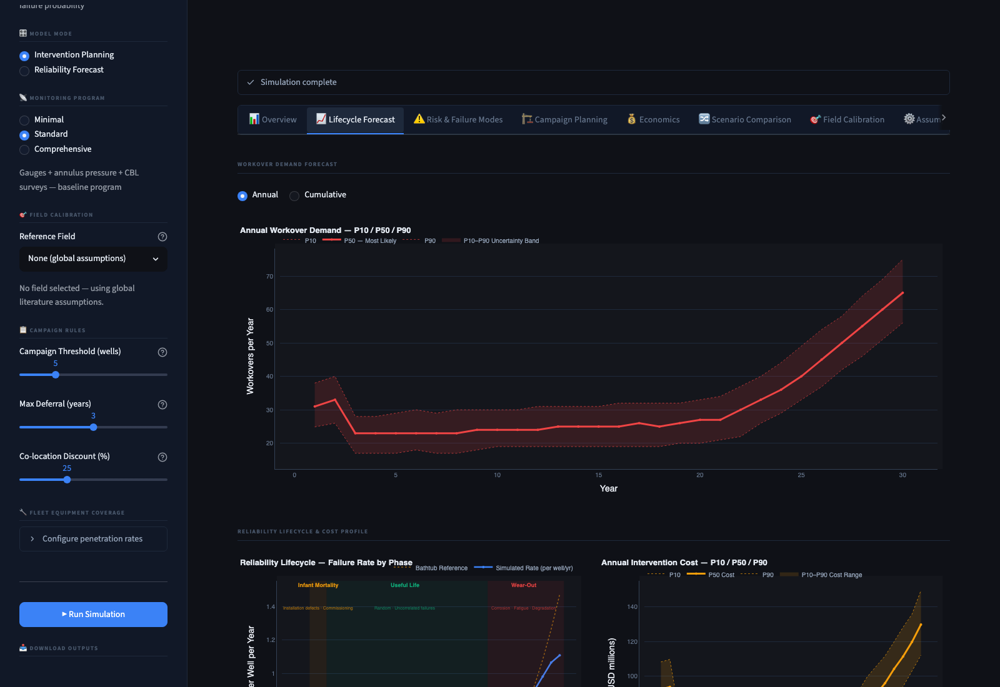
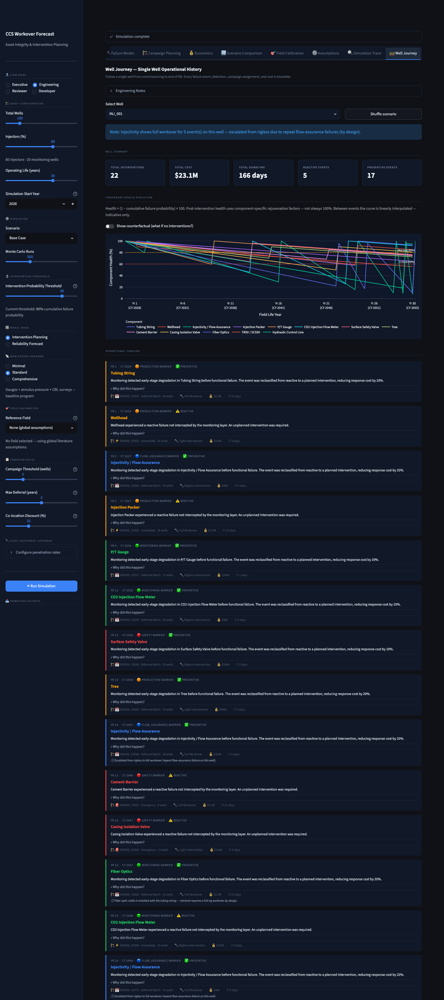
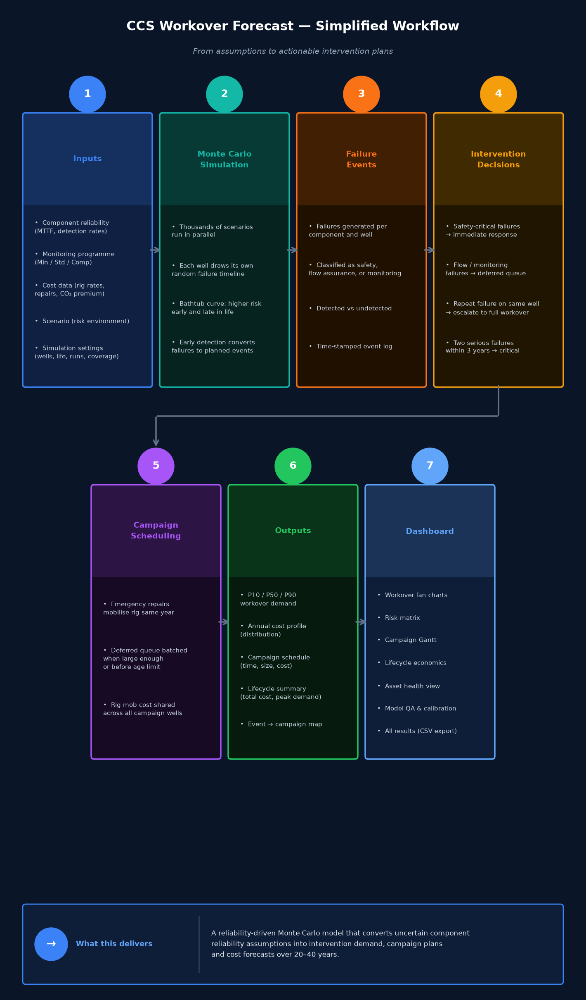

# CCS Workover Forecast

[](https://github.com/djimrastephane/ccs-workover-forecast/actions/workflows/ci.yml)

A Monte Carlo simulator for forecasting intervention demand across a CCS well fleet over a 20–40 year storage lifecycle. Built in Python/Streamlit.

> Developed after reading SPE-232388-MS, which raised the question of how to quantify CCS well intervention demand under uncertainty over a multi-decade storage operation.

---

## Problem

CCS operators face a planning problem with no good analogue in conventional oil and gas:

- **No CCS-specific reliability database exists.** As of 2026, the global CO₂ injection fleet numbers fewer than 50 commercial wells. No CCS equivalent of OREDA has been published. All available failure rate data comes from hydrocarbon-service analogues.
- **Storage operations span 20–40 years.** Integrity decisions made today will affect wells for decades, through phases (infant mortality, useful life, wear-out) with very different failure behaviour.
- **Uncertainty is structural, not resolvable by more analysis.** The range between P10 and P90 workover demand is not model error — it is the honest representation of what we do not yet know about how CO₂ wells age.

This tool does not eliminate that uncertainty. It makes it legible and plannable.

---

## What this tool does

This tool answers four questions:

1. **How many interventions are likely?** — P10/P50/P90 workover demand over the full storage lifecycle.
2. **When will they occur?** — Annual fan charts showing when demand peaks and what drives it.
3. **Will they cluster into campaigns?** — Campaign batching logic that reflects real operational response: emergency mobilisations, deferred batches, co-location savings.
4. **How sensitive are the estimates to uncertainty?** — Sensitivity tornado, scenario comparison, and a field calibration engine that progressively replaces literature assumptions with observed field data.

The application estimates operational consequences arising from uncertainty in component reliability assumptions. It does not predict the exact failure of a particular well.

---

## Demo

[](https://github.com/djimrastephane/ccs-workover-forecast/raw/main/docs/demo.mp4)

---

## Screenshots

**Lifecycle Forecast** — P10/P50/P90 annual workover demand fan chart with bathtub curve and cost profile.


**Well Journey** — Single-well operational history: component health evolution, intervention timeline, and cost breakdown for one stochastic scenario.



---

## Quickstart

```bash
python -m venv .venv
source .venv/bin/activate      # Windows: .venv\Scripts\activate
pip install -r requirements.txt
streamlit run app.py
```

Then open http://localhost:8501 in your browser.

---

## Simulation pipeline



---

## Key capabilities

| Capability | Description |
|---|---|
| Monte Carlo uncertainty | P10/P50/P90 workover demand across up to 10,000 simulation runs |
| Bathtub curve lifecycle | Infant mortality, useful life, and wear-out phases modelled explicitly |
| 19 well components | Across 4 barrier classes; flow assurance split into 4 geochemical sub-modes (hydrate, halite, carbonate, microbial) |
| Barrier hierarchy | Safety failures are always immediate; production and monitoring events are deferrable |
| Campaign batching | Deferred interventions batched by fleet size or maximum wait time |
| Scenario comparison | 6 built-in scenarios: base case, high corrosion, legacy well conversion, and others |
| Field calibration | Observed field events progressively replace literature MTTF assumptions |
| Explainability | Every KPI is traceable to the underlying simulation assumptions |
| Model QA | Calibration score, sensitivity tornado, sanity checks, and assumption quality register |
| Well Journey | Full per-well operational timeline for any stochastic scenario |

---

## Documentation

| Document | Purpose |
|---|---|
| [methodology.md](docs/methodology.md) | Reliability model, bathtub curve, failure detection, intervention engine, campaign logic |
| [assumptions.md](docs/assumptions.md) | Component MTTF database, barrier classes, scenario multipliers, monitoring configuration |
| [calibration.md](docs/calibration.md) | Field calibration equations, confidence weighting, drift alerts, maturity score |
| [economics.md](docs/economics.md) | Cost assumptions, CO₂ uplift, bundling discount, deferred injection penalty |
| [validation.md](docs/validation.md) | QA metrics, sanity checks, calibration score, model challenge guide |
| [architecture.md](docs/architecture.md) | Module structure, dashboard tabs, downloadable outputs, data flow |
| [limitations.md](docs/limitations.md) | Known gaps, data maturity notice, recommended improvements |
| [references.md](docs/references.md) | Full bibliography: SPE, ISO, DNV, IEAGHG, OREDA, WellMaster |

---

## Known limitations (summary)

- All MTTF values are hydrocarbon-service analogues — no CCS-specific reliability database exists as of 2026.
- Calibration score ~38/100 (Pre-FEED): outputs are order-of-magnitude planning estimates, not engineering commitments.
- No Weibull shape parameter within lifecycle phases (exponential model only).
- No rig fleet availability constraint.
- Joule-Thomson cooling and cyclic fatigue degradation are absorbed into MTTF conservatism, not modelled mechanistically.

See [limitations.md](docs/limitations.md) for the full list and roadmap.

---

## References

Key references: SPE-232388-MS (direct methodological basis), NZTC/DNV CCS Wells Technology Roadmap 2025, PMC10407664 (JPN-1 case study), IEAGHG 2018-08, Hardiman et al. 2023 (Peloton WellMaster), ISO 16530-1, ISO 27914, DNV-RP-J203.

See [references.md](docs/references.md) for the full bibliography with annotations.
