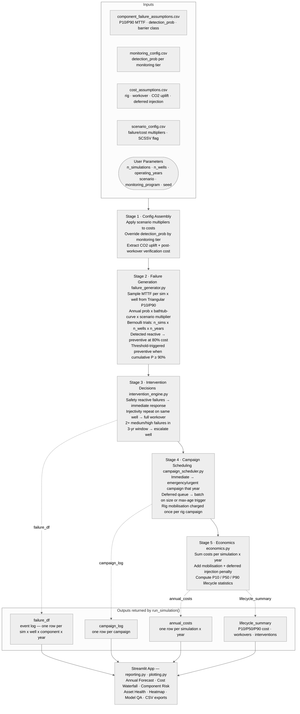

# CCS Workover Forecast

[](https://github.com/djimrastephane/ccs-workover-forecast/actions/workflows/ci.yml)

A reliability-driven Monte Carlo simulator that estimates future workover and intervention demand for CCS wells over a 20–40 year lifecycle. Built in Python/Streamlit.

> Developed after reading SPE-232388-MS, which raised the question of how to model CCS well integrity over a long operating life.

---

## What it does

Given a population of CCS wells and their component reliability assumptions, the simulator answers:

> *How many failures and workovers will emerge over time, and what resources will be needed?*

It produces P10/P50/P90 workover demand, lifecycle cost distributions, campaign batching plans, scenario comparisons, and a model QA audit — all traceable back to the underlying assumptions.

---

## Quickstart

```bash
# Create and activate a virtual environment
python -m venv .venv
source .venv/bin/activate      # Windows: .venv\Scripts\activate

# Install dependencies
pip install -r requirements.txt

# Run the dashboard
streamlit run app.py
```

Then open http://localhost:8501 in your browser.

---

## Project structure

```
ccs-workover-forecast/
├── app.py                          # Streamlit dashboard (8 tabs)
├── requirements.txt
├── data/
│   ├── assumptions/
│   │   ├── component_failure_assumptions.csv   # MTTF + detection probability database
│   │   ├── monitoring_config.csv               # Per-tier detection_prob overrides (minimal / standard / comprehensive)
│   │   ├── assumption_quality.csv              # Source quality, confidence, sensitivity register
│   │   ├── cost_assumptions.csv                # Per-event costs, CO₂ uplift factor, post-workover verification
│   │   └── scenario_config.csv
│   └── outputs/                    # Downloaded CSVs land here
└── src/
    ├── config_loader.py            # Loads CSV assumptions
    ├── reliability_model.py        # MTTF sampling, bathtub curve, cumulative probability
    ├── failure_generator.py        # Vectorised failure + detection + preventive event generation
    ├── intervention_engine.py      # Barrier hierarchy and escalation rules
    ├── campaign_scheduler.py       # Deferred queue batching; immediate event grouping
    ├── economics.py                # Cost aggregation and P10/P50/P90 summary
    ├── simulation.py               # Monte Carlo orchestration
    ├── reporting.py                # Aggregation, health index, heatmap data, narratives
    ├── plotting.py                 # Plotly chart functions
    ├── calibration.py              # Calibration score and uncertainty decomposition
    ├── explainability.py           # Plain-language KPI traceability narratives
    └── qa.py                       # Validation metrics and sanity checks
```

---

## Simulation pipeline



---

## Configuration

All assumptions live in `data/assumptions/`. Edit the CSVs to change reliability parameters, costs, or scenarios — no code changes required.

### Component reliability database

`component_failure_assumptions.csv` — one row per component, MTTF-based.

| Field | Description |
|---|---|
| `component` | Component identifier |
| `display_name` | Human-readable label shown in the dashboard |
| `category` | Functional grouping (tubulars, barriers, monitoring, etc.) |
| `barrier_class` | `safety` / `production` / `monitoring` / `flow_assurance` |
| `P10_MTTF` | Pessimistic mean time to failure (years) — short MTTF, high failure rate |
| `P90_MTTF` | Optimistic mean time to failure (years) — long MTTF, low failure rate |
| `consequence_level` | 1 (Negligible) to 5 (Catastrophic) — drives the risk matrix position |
| `intervention_type` | `full_workover` / `light_intervention` / `rigless_intervention` |
| `can_defer` | Whether the intervention can be queued for batching |
| `safety_critical` | Forces reactive failures to immediate regardless of batching rules |
| `default_cost` | Per-event cost used when cost assumptions don't override |
| `default_duration_days` | Typical intervention duration |
| `injector_only` | Component only present on injection wells |
| `trsv_only` | Component only enabled when TRSV/SCSSV is active (offshore config) |
| `detection_prob` | Probability a developing failure is caught before becoming a reactive emergency |

Fifteen components are modelled across four barrier classes, covering the taxonomy in the NZTC/DNV CCS Wells Technology Roadmap (2025):

| Component | Barrier class | P10 MTTF | P90 MTTF | Intervention type | Detection prob | Notes |
|---|---|---|---|---|---|---|
| TRSV / SCSSV | Safety | 40 yr | 90 yr | Rigless | 70% | trsv_only |
| Cement Barrier | Safety | 50 yr | 120 yr | Full workover | 25% | |
| Casing | Safety | 60 yr | 150 yr | Full workover | 30% | |
| Surface Safety Valve | Safety | 15 yr | 40 yr | Rigless | 80% | |
| Casing Isolation Valve | Safety | 20 yr | 55 yr | Light | 55% | CCS-specific barrier |
| Tubing Hanger Seal | Safety | 30 yr | 70 yr | Light | 50% | |
| Tubing String | Production | 35 yr | 55 yr | Full workover | 40% | |
| Injection Packer | Production | 25 yr | 50 yr | Full workover | 35% | |
| Wellhead | Production | 45 yr | 75 yr | Light | 60% | |
| Tree | Production | 40 yr | 70 yr | Light | 55% | |
| Hydraulic Control Line | Production | 10 yr | 25 yr | Rigless | 85% | trsv_only |
| Injectivity / Flow Assurance | Flow assurance | 8 yr | 20 yr | Rigless (escalates) | 50% | injector_only |
| P/T Gauge | Monitoring | 15 yr | 26 yr | Rigless | 90% | |
| Fiber Optics | Monitoring | 12 yr | 26 yr | Rigless | 85% | |
| CO₂ Injection Flow Meter | Monitoring | 8 yr | 22 yr | Rigless | 70% | injector_only; MMV compliance |

Safety barriers (TRSV, Cement, Casing, SSV, CIV, Tubing Hanger) carry longer MTTF values reflecting their role as the last line of defence — failures are rare, high-consequence events, not routine cost drivers. Detection probability is low for downhole safety barriers because defects (micro-annuli, casing corrosion) develop below the surface and are hard to identify without integrity testing programmes.

### Reliability model

Each simulation draws an MTTF value **independently per (simulation, well)** from a triangular distribution between P10 and P90 (mode at midpoint). Drawing per well rather than per simulation prevents the artefact where all wells in a simulation age in lockstep and fail in the same year.

Annual failure probability is derived via the exponential reliability model:

```
P(fail) = 1 − exp(−1 / sampled_MTTF)
```

A **bathtub curve lifecycle multiplier** is applied on top of the base probability each year:

| Phase | Years | Multiplier | Failure modes |
|---|---|---|---|
| Infant mortality | 1–2 | 1.5× | Installation damage, commissioning defects, poor packer setting |
| Useful life | 3–70% of field life | 1.0× | Random, uncorrelated failures |
| Wear-out | Final 30% of field life | 1.0× → 1.8× | Corrosion, fatigue, elastomer degradation, injectivity decline |

Wear-out multiplier: `1 + ((year − wear_start) / (life − wear_start)) × 0.8` — a linear ramp to 1.8× maximum, reflecting gradual degradation rather than a sudden cliff at end of life.

### Detection, monitoring program, and trigger types

Each component has a `detection_prob` — the probability that a developing failure is identified before it escalates to an unplanned event. Detected failures are reclassified as `preventive` (planned, deferrable, 80% of reactive cost). Undetected failures remain `reactive`.

The **monitoring program** selector (Minimal / Standard / Comprehensive) overrides `detection_prob` for every component from `monitoring_config.csv`:

| Program | Technology | Typical detection range |
|---|---|---|
| Minimal | Downhole P/T gauges + periodic wireline surveys | 10–75% |
| Standard (default) | Gauges + annulus pressure monitoring + CBL/caliper surveys | 25–90% |
| Comprehensive | DTS/DAS fibre + wireless B-annulus + corrosion monitoring | 50–92% |

Full-scale simulations (100 wells) show ~$87M P50 lifecycle cost difference between minimal and comprehensive monitoring, confirming early-detection investment is economic.

> **Monitoring tool sensitivity floor**: the PMC10407664 JPN-1 case study found that commercial acoustic/CBL tools failed to detect a micro-annulus entirely — leakage was only identified via temperature anomalies. This is reflected in the comprehensive-tier cement_barrier and casing detection_prob being capped at 0.45 rather than the 0.50 initially assumed. Even the best available tooling cannot guarantee detection of sub-threshold leakage rates.

A second preventive mechanism fires when **cumulative failure probability** (the product of all annual survivals to date) exceeds the user-set threshold (default 90%). This is the probability of surviving to year *t*, not the single-year probability. A threshold-preventive event is always deferrable and costs 80% of the reactive equivalent.

### Intervention probability threshold

A user-controlled threshold (70–95%, default 90%) triggers planned interventions before cumulative failure probability crosses that level. Reducing the threshold increases planned cost but reduces unplanned emergency campaigns.

### Cost assumptions

`cost_assumptions.csv` — costs by scenario (`base_case`, `offshore_high_cost`).

| Cost item | Base case | Notes |
|---|---|---|
| Rig mobilisation | $2,000,000 / campaign | |
| Full workover | $2,500,000 / well | Before CO₂ uplift |
| Light intervention | $500,000 / well | Before CO₂ uplift |
| Rigless intervention | $200,000 / event | Before CO₂ uplift |
| Deferred injection cost | $50,000 / day / well | |
| Post-workover verification | $200,000 / full workover | CBL + casing inspection + pressure test |
| CO₂ handling uplift factor | 1.15× | Applied to all per-event intervention costs |

**CO₂ handling uplift** (1.15× base, 1.20× offshore): covers CO₂-rated BOP equipment and special procedures — per NZTC/DNV CCS Wells Technology Roadmap §4.2.1. Applied multiplicatively to rigless, light, and full workover costs before the scenario cost multiplier.

**Post-workover verification**: mandatory CBL + casing inspection + pressure test required before CO₂ re-injection clearance after any full rig workover. Added as a fixed adder on top of the full workover cost (after CO₂ uplift).

The deferred injection penalty applies to rig workovers sitting in the deferred queue. Cost = (days waiting) × (daily rate) × (deferred rig jobs), summed per well.

### Scenario configuration

`scenario_config.csv` — five built-in scenarios with failure probability and cost multipliers.

| Scenario | Failure multiplier | Cost multiplier | Notes |
|---|---|---|---|
| Base Case | 1.0× | 1.0× | Balanced baseline |
| Conservative Design | 0.6× | 1.1× | High-spec wells, premium materials |
| Low-Cost Design | 1.5× | 0.9× | Cost-optimised, higher failure risk |
| High Corrosion | 1.8× | 1.3× | Aggressive CO₂ corrosion; higher intervention complexity |
| Offshore High-Cost | 1.2× | 1.6× | Deepwater or harsh environment |
| Legacy Well Conversion | 2.5× | 1.4× | Converted abandoned O&G wellbore — material incompatibility, unknown construction history; SCSSV disabled; per PMC10407664 |

---

## Dashboard tabs

| Tab | Contents |
|---|---|
| Executive Summary | KPI cards (P50/P90 workovers, lifecycle cost, peak demand, threshold split), asset health index, KPI traceability expanders, executive narrative |
| Lifecycle Forecast | Annual P10/P50/P90 workover fan chart, bathtub curve with phase annotations, cost fan chart |
| Risk & Failure Modes | 5×5 risk matrix, component lifecycle failure probability heatmap, cost contribution breakdown, risk traceability |
| Campaign Planning | Bubble Gantt across sample simulations, deferred queue evolution, immediate vs deferred split |
| Economics | Waterfall cost breakdown, lifecycle cost distribution, cost by component, cost traceability |
| Scenario Comparison | Side-by-side comparison of multiple scenario runs |
| Model QA | Calibration score, assumption quality register, critical calibration gaps, MTTF uncertainty tornado, validation metrics, sanity checks, campaign type breakdown |
| Assumptions | Live view of all CSV assumption tables with quality register and engineering defensibility panel |

---

## Outputs (downloadable from sidebar)

| File | Contents |
|---|---|
| `failure_event_log.csv` | Every simulated event — includes `trigger_type`, `sampled_mttf`, `lifecycle_multiplier`, `adjusted_probability` |
| `annual_forecast.csv` | Per-year P10/P50/P90 intervention and workover demand |
| `campaign_log.csv` | Every campaign with type, size, cost breakdown |
| `simulation_summary.csv` | Lifecycle P10/P50/P90 statistics for the active run |
| `annual_economics.csv` | Annual cost breakdown (intervention + mob + deferred injection) |

---

## Modelling notes

### Cost convention

- `estimated_cost` (per event) covers all per-intervention costs including materials and rig time.
- `mobilisation_cost` (per campaign) is the rig mob/demob overhead added once per campaign.
- `deferred_injection_cost` is the CO₂ storage revenue lost while a workover waits in the deferred queue.
- Planned interventions (preventive or threshold-triggered) are priced at 80% of the equivalent reactive cost.
- Total lifecycle cost = sum of all three. No double-counting.

### Barrier hierarchy

The intervention engine applies priority rules based on `barrier_class` and `trigger_type`:

- **Safety reactive** (undetected TRSV, Cement, Casing failures) — always immediate emergency campaign.
- **Safety preventive** (caught by inspection or monitoring) — deferrable; treated as planned maintenance.
- **Production** (Tubing, Packer, Wellhead, Tree) — deferrable; batched into campaigns unless escalated.
- **Monitoring** (Gauge, Fiber Optics) — always deferrable regardless of trigger type.
- **Flow assurance** (Injectivity) — rigless intervention first; escalates to full workover on the second failure per well.

### Escalation rule

If a well accumulates ≥ 2 medium-or-high severity **reactive** failures within any 3-year window, its remaining reactive deferred events are promoted to immediate priority. Preventive events are never escalated — they are already scheduled optimally.

### Campaign trigger logic

Deferred interventions accumulate in a per-simulation queue. A batch campaign fires when either:
- The queue reaches `campaign_threshold` events (default 5), or
- The oldest queued item has waited `max_deferral_years` years (default 3).

Immediate interventions within the same year are grouped rather than executed as individual mobilisations:
- Emergency events (reactive safety failures): one shared emergency campaign per year.
- Urgent events (escalated production failures): one shared urgent campaign per year.

### Randomness and reproducibility

The global random seed (default 42) is set once in `run_simulation()`. The same inputs always produce the same outputs. Change the seed in `src/simulation.py` for an independent draw.

---

## Known limitations

1. **No component renewal after repair** — a repaired component restarts with the same MTTF distribution as a new one (repair-to-as-new). A repair-to-as-old distinction would improve late-life accuracy.
2. **No rig availability constraint** — the scheduler does not cap simultaneous campaigns by rig count or vessel availability.
3. **Single deferred injection rate** — all deferred rig workovers are penalised at the same daily rate regardless of well productivity.
4. **No spatial or cluster logic** — all wells are treated as independent. Geographic clustering of campaigns is not modelled.
5. **Exponential (memoryless) failure model within phases** — the bathtub curve captures phase-level hazard change but the exponential model within each phase has no memory. Weibull shape parameter is not yet implemented.
6. **Low calibration score (41/100)** — several high-sensitivity parameters (cement P90 MTTF, packer P90 MTTF, injectivity P90 MTTF, intervention threshold) rely on expert judgement or synthetic assumptions with no direct CCS field data. Outputs should be treated as order-of-magnitude planning estimates, not engineering commitments. The Model QA tab shows the full breakdown.
7. **Joule-Thomson cooling not explicitly modelled** — CO₂ depressurisation during well control events can cool valves to −78 °C (confirmed by the NZTC SSSV JIP tests down to −78.5 °C). This extreme thermal shock is a CCS-specific failure driver for TRSV, SSV, and packers; it is currently absorbed into the conservative MTTF assumptions rather than modelled as a distinct mechanism.
8. **Thermal/pressure cycling degradation not captured** — cyclical CO₂ injection (on-off supply, workovers, ship unloading intervals) causes progressive cement debonding, casing fatigue, and elastomer creep beyond what the bathtub wear-out ramp captures. IEAGHG 2018-08 (§2.1.8, Torsaeter 2018) documents an average of ~2 years for integrity problems to emerge when wells are operated outside their initial design envelope — consistent with the infant mortality window (years 1–2, 1.5× bathtub multiplier) but with long-term cyclic accumulation not explicitly captured. A future cyclic-fatigue degradation model would improve late-life cement and packer accuracy.
9. **Legacy well conversion risk not fully captured** — the PMC10407664 JPN-1 case study (Indonesia) found that a 10-year-idle well required mandatory re-completion even after a full workover: corrosion rate exceeded 2 mm/yr, existing casing was incompatible with CO₂, and acoustic CBL tools failed to detect the micro-annulus (temperature logging found 2 leaks at 440 m and 881 m that CBL missed). The **Legacy Well Conversion** scenario (2.5× failure multiplier, 1.4× cost multiplier, SCSSV disabled) approximates this risk profile; however, idle-period degradation and material incompatibility are absorbed into the MTTF distribution rather than modelled mechanistically. Counter-evidence from Wabamun Lake, Alberta (Nygaard et al. 2014, via IEAGHG 2018-08 §5.1): of 1,000 wells penetrating the caprock, 95 required detailed study, but only 4 of 27 closely examined wells ultimately required workover — suggesting that not all legacy wells need intervention; the 2.5× multiplier captures the worst-case inadequately-assessed-history population, not the broader legacy well universe.

## Recommended next improvements

1. Add Weibull shape parameter to capture intra-phase increasing hazard.
2. Add a rig fleet capacity constraint to cap simultaneous campaigns.
3. Add per-well repair history to adjust future MTTF based on cumulative failure count.
4. Enable CSV upload in the Assumptions tab for project-specific calibration without file editing.
5. Field-calibrate the high-sensitivity parameters (cement MTTF, packer MTTF, intervention threshold) using CCS pilot data as it becomes available.
6. Add a legacy-well module to model remediation campaigns for pre-existing O&G wellbores within the storage licence area.
7. Implement a cyclic-fatigue multiplier on cement and elastomeric seals to reflect injection pressure cycling over multi-decade operation.

---

## Key references

| Reference | Relevance |
|---|---|
| SPE-232388-MS | Original inspiration for modelling CCS well integrity over a long operating life |
| [NZTC / DNV — CCS Wells Technology Roadmap (2025)](https://www.netzerotc.com/wp-content/uploads/2025/10/CCS_Wells_Technology_Roadmap_report.pdf) | Component taxonomy, CCS-specific failure mechanisms (Joule-Thomson, carbonation, thermal cycling), intervention and monitoring technology landscape |
| [PMC10407664 — JPN-1 CCS Pilot Well Integrity Assessment (2023)](https://pmc.ncbi.nlm.nih.gov/articles/PMC10407664/) | Real-world case study of abandoned well conversion to CO₂ injection; calibrates cement_barrier detection_prob (CBL tool failure); supports Legacy Well Conversion scenario (2.5× multiplier) and monitoring tool sensitivity floor |
| ISO 16530-1:2017 | Well integrity — lifecycle governance; defines barrier element hierarchy and well status classification used throughout this model |
| ISO 16530-2:2013 | Well integrity — operational phase; inspection intervals and acceptance criteria that inform detection_prob and MTTF assumptions |
| ISO 27914:2017 | CO₂ geological storage — well infrastructure, integrity, and monitoring requirements |
| API RP 90 | Annular casing pressure management in offshore wells — directly relevant to casing_valve and sustained casing pressure failure modes |
| API Spec 5CRA | Corrosion-resistant alloy seamless tubes — material qualification standard for CO₂ service; used to validate tubing P10_MTTF assumptions |
| IOGP Report 676 | Well abandonment and integrity evaluation for CO₂ storage |
| NORSOK D-010 | Well integrity in drilling and well operations; used to guide CCS well construction and MTTF analogues |
| DNV-RP-J203 | Geological storage of CO₂ — recommended practices for MMV and well assessment |
| [IEAGHG Technical Report 2018-08 — Well Engineering and Injection Regularity in CO₂ Storage Wells](https://ieaghg.org/publications/2018-08%20Well%20Engineering%20and%20Injection%20Regularity%20in%20CO2%20Storage%20Wells.pdf) | Well engineering best practices for CO₂ EOR and storage wells; Norwegian North Sea injector leakage rates (37–41% of injectors, Randhol and Carlsen 2008); Alberta gas migration rates (4.6% of 316,000 deep wells, Watson and Bachu 2007); SACROC 30-year Portland cement field evidence (structural integrity retained, CO₂ migration only 10–12 ft above reservoir); ~2 years average time for integrity problems outside design envelope (Torsaeter 2018); dry CO₂ (>95% purity) LOW corrosion risk calibration; CO₂ EOR O&M costs ~2× conventional O&G (§2.1.10) — validates 1.15× storage uplift as conservative; tubular service life 20–25 years with modern handling techniques (§9, Contek/API 2008); MIT H-5 testing every 5 years for Class II injection wells (§8.4, Oxy Wasson/TRCC); MIT mandatory after every workover by regulation (§3.1.2) — validates post_workover_verification_cost as obligatory; Core Energy Michigan: 80% converted injectors, zero well control incidents since 1996 on dry CO₂ (§8.6); CBL bond index 0.71–0.73 from 278 field logs in Michigan/Ohio (§8.5, Sminchak et al. 2013); Sleipner §5.3: halite precipitation confirmed dominant injectivity mechanism (solid particle displacement ruled out); zonal isolation maintained 70+ years in 1940s Midwest wells (SCP gas confirmed not from reservoir); Texas Class II 5–11% noncompliance vs <1% other states (Table 3, GAO 2014) — calibrates high_corrosion scenario geography |
