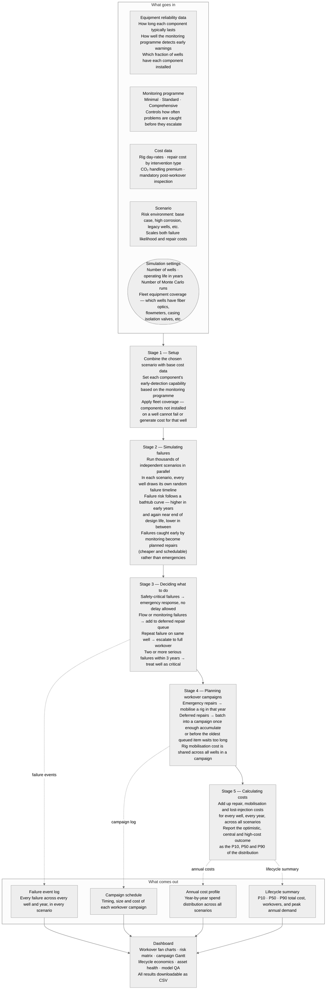

# CCS Workover Forecast

[](https://github.com/djimrastephane/ccs-workover-forecast/actions/workflows/ci.yml)

A reliability-driven Monte Carlo simulator that estimates future workover and intervention demand for CCS wells over a 20–40 year lifecycle. Built in Python/Streamlit.

> Developed after reading SPE-232388-MS, which raised the question of how to model CCS well integrity over a long operating life.

---

## What it does

Given a population of CCS wells and their component reliability assumptions, the simulator answers:

> *How many failures and workovers will emerge over time, and what resources will be needed?*

It produces P10/P50/P90 workover demand, lifecycle cost distributions, campaign batching plans, scenario comparisons, and a model QA audit — all traceable back to the underlying assumptions.

---

## Quickstart

```bash
# Create and activate a virtual environment
python -m venv .venv
source .venv/bin/activate      # Windows: .venv\Scripts\activate

# Install dependencies
pip install -r requirements.txt

# Run the dashboard
streamlit run app.py
```

Then open http://localhost:8501 in your browser.

---

## Project structure

```
ccs-workover-forecast/
├── app.py                          # Streamlit dashboard (9 tabs)
├── requirements.txt
├── data/
│   ├── assumptions/
│   │   ├── component_failure_assumptions.csv   # MTTF + detection probability database
│   │   ├── monitoring_config.csv               # Per-tier detection_prob overrides (minimal / standard / comprehensive)
│   │   ├── assumption_quality.csv              # Source quality, confidence, sensitivity register
│   │   ├── cost_assumptions.csv                # Per-event costs, CO₂ uplift factor, post-workover verification
│   │   └── scenario_config.csv
│   ├── observations/
│   │   └── observed_events.csv                 # Real field failure/degradation events for calibration
│   ├── calibration/                            # Auto-generated per-field calibration factor exports
│   └── outputs/                    # Downloaded CSVs land here
└── src/
    ├── config_loader.py            # Loads CSV assumptions
    ├── reliability_model.py        # MTTF sampling, bathtub curve, cumulative probability
    ├── failure_generator.py        # Vectorised failure + detection + preventive event generation
    ├── intervention_engine.py      # Barrier hierarchy and escalation rules
    ├── campaign_scheduler.py       # Deferred queue batching; immediate event grouping
    ├── bundling.py                 # Co-location discount — secondary components pay discounted cost when multiple fail same well/year
    ├── economics.py                # Cost aggregation and P10/P50/P90 summary
    ├── simulation.py               # Monte Carlo orchestration
    ├── field_calibration.py        # Observed vs expected failure rate comparison; MTTF calibration; maturity score; drift detection
    ├── reporting.py                # Aggregation, health index, heatmap data, narratives
    ├── plotting.py                 # Plotly chart functions
    ├── calibration.py              # Calibration score and uncertainty decomposition
    ├── explainability.py           # Plain-language KPI traceability narratives
    └── qa.py                       # Validation metrics and sanity checks
```

---

## Simulation pipeline

The model answers one question: **over the operating life of a CO₂ storage field, how many times will wells need intervention, when will those interventions cluster, and what will they cost?** It does this by running thousands of independent "what-if" scenarios simultaneously and reporting the range of outcomes (optimistic, central, and high-cost).



**Reading the outputs — what P10 / P50 / P90 means:**
The model runs the same field hundreds or thousands of times, each with a different random sequence of failures. P50 is the median outcome — half of simulated futures cost less, half cost more. P10 is the optimistic end (only 10% of futures are cheaper). P90 is the high-cost end (only 10% of futures are more expensive). The gap between P10 and P90 is the model's uncertainty range, driven mainly by how uncertain the reliability assumptions are.

| Stage | Source file | Key logic |
|---|---|---|
| 1 — Setup | `simulation.py` · `config_loader.py` | Scenario multipliers, monitoring override, CO₂ uplift, fleet coverage patch |
| 2 — Failure generation | `failure_generator.py` | Triangular MTTF sample per (sim, well); bathtub curve; Bernoulli draws; penetration mask |
| 3 — Intervention decisions | `intervention_engine.py` | Barrier hierarchy; injectivity escalation; multi-failure escalation |
| 4 — Campaign scheduling | `campaign_scheduler.py` | Immediate queue; deferred batch by size or max-age; mob cost allocation |
| 5 — Economics | `economics.py` | Per-(sim, year) cost aggregation; P10/P50/P90 lifecycle statistics |

---

## Configuration

All assumptions live in `data/assumptions/`. Edit the CSVs to change reliability parameters, costs, or scenarios — no code changes required.

### Component reliability database

`component_failure_assumptions.csv` — one row per component, MTTF-based.

| Field | Description |
|---|---|
| `component` | Component identifier |
| `display_name` | Human-readable label shown in the dashboard |
| `category` | Functional grouping (tubulars, barriers, monitoring, etc.) |
| `barrier_class` | `safety` / `production` / `monitoring` / `flow_assurance` |
| `P10_MTTF` | Pessimistic mean time to failure (years) — short MTTF, high failure rate |
| `P90_MTTF` | Optimistic mean time to failure (years) — long MTTF, low failure rate |
| `consequence_level` | 1 (Negligible) to 5 (Catastrophic) — drives the risk matrix position |
| `intervention_type` | `full_workover` / `light_intervention` / `rigless_intervention` |
| `can_defer` | Whether the intervention can be queued for batching |
| `safety_critical` | Forces reactive failures to immediate regardless of batching rules |
| `default_cost` | Per-event cost used when cost assumptions don't override |
| `default_duration_days` | Typical intervention duration |
| `injector_only` | Component only present on injection wells |
| `trsv_only` | Component only enabled when TRSV/SCSSV is active (offshore config) |
| `detection_prob` | Probability a developing failure is caught before becoming a reactive emergency |
| `penetration_rate` | Fraction of wells in the fleet that have this component installed (0.0–1.0). Default `1.0` means every well is equipped. Set to e.g. `0.6` to model a mixed fleet where only 60% of wells have this component. The equipped subset is drawn randomly from the fleet and held fixed across all simulations within a run. |

Fifteen components are modelled across four barrier classes, covering the taxonomy in the NZTC/DNV CCS Wells Technology Roadmap (2025):

| Component | Barrier class | P10 MTTF | P90 MTTF | Intervention type | Detection prob (standard tier) | Notes |
|---|---|---|---|---|---|---|
| TRSV / SCSSV | Safety | 30 yr | 65 yr | Rigless | 70% | trsv_only; assumes wireline-retrievable (WRTRSV) design; SPE-232388-MS Table 1 |
| Cement Barrier | Safety | 50 yr | 70 yr | Full workover | 25% | Michigan 70yr field evidence (IEAGHG 2018-08) is the longest available empirical upper bound |
| Casing | Safety | 60 yr | 150 yr | Full workover | 30% | |
| Surface Safety Valve | Safety | 15 yr | 40 yr | Rigless | 80% | |
| Casing Isolation Valve | Safety | 20 yr | 55 yr | Light | 55% | CCS-specific barrier |
| Tubing Hanger Seal | Safety | 30 yr | 70 yr | Full workover | 50% | primary metal-to-metal seal failure requires pulling tubing |
| Tubing String | Production | 35 yr | 55 yr | Full workover | 40% | |
| Injection Packer | Production | 22 yr | 38 yr | Full workover | 35% | SPE-232388-MS Table 1 |
| Wellhead | Production | 45 yr | 75 yr | Light | 60% | |
| Tree | Production | 40 yr | 70 yr | Light | 55% | |
| Hydraulic Control Line | Safety | 10 yr | 25 yr | Full workover | 85% | trsv_only; line runs outside tubing string — replacement requires pulling tubing |
| Injectivity / Flow Assurance | Flow assurance | 8 yr | 20 yr | Rigless (escalates) | 50% | injector_only |
| P/T Gauge | Monitoring | 15 yr | 26 yr | Rigless | 90% | |
| Fiber Optics | Monitoring | 12 yr | 26 yr | Full workover | 85% | conventional permanent installation strapped to tubing; replacement requires pulling the tubing string |
| CO₂ Injection Flow Meter | Monitoring | 8 yr | 22 yr | Rigless | 70% | injector_only; MMV compliance |

Safety barriers (TRSV, Cement, Casing, SSV, CIV, Tubing Hanger) carry longer MTTF values reflecting their role as the last line of defence — failures are rare, high-consequence events, not routine cost drivers. Detection probability is low for downhole safety barriers because defects (micro-annuli, casing corrosion) develop below the surface and are hard to identify without integrity testing programmes.

### Reliability model

Each simulation draws an MTTF value **independently per (simulation, well)** from a triangular distribution between P10 and P90 (mode at midpoint). Drawing per well rather than per simulation prevents the artefact where all wells in a simulation age in lockstep and fail in the same year.

Annual failure probability is derived via the exponential reliability model:

```
P(fail) = 1 − exp(−1 / sampled_MTTF)
```

A **bathtub curve lifecycle multiplier** is applied on top of the base probability each year:

| Phase | Years | Multiplier | Failure modes |
|---|---|---|---|
| Infant mortality | 1–2 | 1.5× | Installation damage, commissioning defects, poor packer setting |
| Useful life | 3–70% of field life | 1.0× | Random, uncorrelated failures |
| Wear-out | Final 30% of field life | 1.0× → 1.8× | Corrosion, fatigue, elastomer degradation, injectivity decline |

Wear-out multiplier: `1 + ((year − wear_start) / (life − wear_start)) × 0.8` — a linear ramp to 1.8× maximum, reflecting gradual degradation rather than a sudden cliff at end of life.

### Detection, monitoring program, and trigger types

Each component has a `detection_prob` — the probability that a developing failure is identified before it escalates to an unplanned event. Detected failures are reclassified as `preventive` (planned, deferrable, 80% of reactive cost). Undetected failures remain `reactive`.

The **monitoring program** selector (Minimal / Standard / Comprehensive) overrides `detection_prob` for every component from `monitoring_config.csv`:

| Program | Technology | Typical detection range |
|---|---|---|
| Minimal | Downhole P/T gauges + periodic wireline surveys | 10–75% |
| Standard (default) | Gauges + annulus pressure monitoring + CBL/caliper surveys | 25–90% |
| Comprehensive | DTS/DAS fibre + wireless B-annulus + corrosion monitoring | 50–92% |

Full-scale simulations (100 wells) show ~$87M P50 lifecycle cost difference between minimal and comprehensive monitoring, confirming early-detection investment is economic.

> **Monitoring tool sensitivity floor**: the PMC10407664 JPN-1 case study found that commercial acoustic/CBL tools failed to detect a micro-annulus entirely — leakage was only identified via temperature anomalies. This is reflected in the comprehensive-tier cement_barrier and casing detection_prob being capped at 0.45 rather than the 0.50 initially assumed. Even the best available tooling cannot guarantee detection of sub-threshold leakage rates.

A second preventive mechanism fires when **cumulative failure probability** (the product of all annual survivals to date) exceeds the user-set threshold (default 90%). This is the probability of surviving to year *t*, not the single-year probability. A threshold-preventive event is always deferrable and costs 80% of the reactive equivalent.

### Intervention probability threshold

A user-controlled threshold (70–95%, default 90%) triggers planned interventions before cumulative failure probability crosses that level. Reducing the threshold increases planned cost but reduces unplanned emergency campaigns.

### Cost assumptions

> **These figures are illustrative North Sea analogues and must be replaced with project-specific costs before using outputs for any commercial or investment decision.** Rig day-rates, workover costs, and deferred injection penalties vary significantly by geography, water depth, rig type, and operator contract. Edit `data/assumptions/cost_assumptions.csv` to reflect your project.

`cost_assumptions.csv` — costs by scenario (`base_case`, `offshore_high_cost`).

| Cost item | Base case (illustrative) | Notes |
|---|---|---|
| Rig mobilisation | $2,000,000 / campaign | North Sea analogue — replace with project rig spread rate |
| Full workover | $2,500,000 / well | Before CO₂ uplift — covers tubing pull, re-completion |
| Light intervention | $500,000 / well | Before CO₂ uplift — wellhead / tree work, no tubing pull |
| Rigless intervention | $200,000 / event | Before CO₂ uplift — wireline or coiled tubing only |
| Deferred injection cost | $50,000 / day / well | Carbon credit proxy — high uncertainty, do not use for investment decisions |
| Post-workover verification | $200,000 / full workover | CBL + casing inspection + pressure test |
| CO₂ handling uplift factor | 1.15× | Applied to all per-event intervention costs |

**CO₂ handling uplift** (1.15× base, 1.20× offshore): covers CO₂-rated BOP equipment and special procedures — per NZTC/DNV CCS Wells Technology Roadmap §4.2.1. Applied multiplicatively to rigless, light, and full workover costs before the scenario cost multiplier.

**Co-location bundling discount** (default 25%): when multiple components fail on the same well in the same simulation year, the most expensive component pays the full standalone cost; each additional component pays `discount_factor × standalone_cost`. Reflects shared rig mobilisation, shared BOP rigging, and parallel workover efficiency. The discount applies only to `estimated_cost` — it does not affect workover or event counts. Configurable via sidebar slider (0–60%).

**Post-workover verification**: mandatory CBL + casing inspection + pressure test required before CO₂ re-injection clearance after any full rig workover. Added as a fixed adder on top of the full workover cost (after CO₂ uplift).

The deferred injection penalty applies to rig workovers sitting in the deferred queue. Cost = (days waiting) × (daily rate) × (deferred rig jobs), summed per well.

### Field calibration

As CCS fields accumulate operational history, observed failure rates should replace literature-derived MTTF assumptions. The calibration engine in `src/field_calibration.py` does this automatically.

**How it works:**

```
Observed failure rate   = observed_failures / total_well_years
Expected failure rate   = 1 − exp(−1 / mode_MTTF)
Calibration factor      = observed_rate / expected_rate
Confidence              = min(n_observed / 20, 1.0)
Effective factor        = 1 + confidence × (calibration_factor − 1)
Calibrated MTTF         = base_MTTF / effective_factor
```

The confidence weighting prevents a single observed event from rewriting assumptions — at 1 event the effective factor shifts only 5% of the way toward the calibration factor; at 20+ events it fully converges.

**To add your field data**, append rows to `data/observations/observed_events.csv`:

| Column | Description |
|---|---|
| `field_id` | Field identifier (e.g. `FIELD_A`) |
| `well_id` | Well identifier |
| `component` | Must match a component in `component_failure_assumptions.csv` |
| `install_year` | Year the component was installed |
| `event_year` | Year of failure / degradation |
| `event_type` | `failure` or `degradation` (counted for calibration); `inspection` or `maintenance` (informational only) |

Then select the field in the sidebar **Reference Field** selector. The model automatically applies calibrated MTTF values before running the simulation.

**Reliability Maturity Score (0–100):** displayed in the Field Calibration tab. Combines years of operational history (30%), observed event count (30%), component coverage (20%), and mean calibration confidence (20%). Levels: Concept study → Pre-FEED → FEED → Early operations → Mature field.

**Drift alerts** fire when a component's calibration factor exceeds 1.5× (model is optimistic) or falls below 0.5× (model is conservative), with a minimum 10% confidence threshold to suppress noise from single events.

### Scenario configuration

`scenario_config.csv` — five built-in scenarios with failure probability and cost multipliers.

| Scenario | Failure multiplier | Cost multiplier | Notes |
|---|---|---|---|
| Base Case | 1.0× | 1.0× | Balanced baseline |
| Conservative Design | 0.6× | 1.1× | High-spec wells, premium materials |
| Low-Cost Design | 1.5× | 0.9× | Cost-optimised, higher failure risk |
| High Corrosion | 1.8× | 1.3× | Aggressive CO₂ corrosion; higher intervention complexity |
| Offshore High-Cost | 1.2× | 1.6× | Deepwater or harsh environment |
| Legacy Well Conversion | 2.5× | 1.4× | Converted abandoned O&G wellbore — material incompatibility, unknown construction history; SCSSV disabled; per PMC10407664 |

---

## Dashboard tabs

| Tab | Contents | View modes |
|---|---|---|
| Executive Summary | KPI cards (P50/P90 workovers, lifecycle cost, peak demand, threshold split), asset health index, KPI traceability expanders, executive narrative | All |
| Lifecycle Forecast | Annual P10/P50/P90 workover fan chart, bathtub curve with phase annotations, cost fan chart | Engineering, Developer |
| Risk & Failure Modes | 5×5 risk matrix, component lifecycle failure probability heatmap, cost contribution breakdown, risk traceability | Engineering, Developer |
| Campaign Planning | Bubble Gantt across sample simulations, deferred queue evolution, immediate vs deferred split | Engineering, Developer |
| Economics | Waterfall cost breakdown, lifecycle cost distribution, cost by component, cost traceability | Engineering, Developer |
| Scenario Comparison | Side-by-side comparison of multiple scenario runs | Engineering, Developer |
| Field Calibration | Reliability maturity score; per-component calibration factors (observed vs expected rate); drift alerts; recommended MTTF updates; observed event log; OREDA HC-service limitation workflow | Engineering, Developer |
| Model QA | Calibration score, assumption quality register, critical calibration gaps, MTTF uncertainty tornado, validation metrics, sanity checks, campaign type breakdown | Engineering, Developer |
| Assumptions | Live view of all CSV assumption tables with quality register and engineering defensibility panel | Engineering, Developer |

The view mode selector (Executive / Engineering / Developer) in the sidebar controls tab visibility. Executive shows Overview only. Developer adds the peak intervention calendar year narrative and additional diagnostic detail.

---

## Outputs (downloadable from sidebar)

| File | Contents |
|---|---|
| `failure_event_log.csv` | Every simulated event — includes `trigger_type`, `sampled_mttf`, `lifecycle_multiplier`, `adjusted_probability` |
| `annual_forecast.csv` | Per-year P10/P50/P90 intervention and workover demand |
| `campaign_log.csv` | Every campaign with type, size, cost breakdown |
| `simulation_summary.csv` | Lifecycle P10/P50/P90 statistics for the active run |
| `annual_economics.csv` | Annual cost breakdown (intervention + mob + deferred injection) |

---

## Modelling notes

### Cost convention

- `estimated_cost` (per event) covers all per-intervention costs including materials and rig time.
- `mobilisation_cost` (per campaign) is the rig mob/demob overhead added once per campaign.
- `deferred_injection_cost` is the CO₂ storage revenue lost while a workover waits in the deferred queue.
- Planned interventions (preventive or threshold-triggered) are priced at 80% of the equivalent reactive cost.
- Total lifecycle cost = sum of all three. No double-counting.

### Barrier hierarchy

The intervention engine applies priority rules based on `barrier_class` and `trigger_type`:

- **Safety reactive** (undetected TRSV, Cement, Casing failures) — always immediate emergency campaign.
- **Safety preventive** (caught by inspection or monitoring) — deferrable; treated as planned maintenance.
- **Production** (Tubing, Packer, Wellhead, Tree) — deferrable; batched into campaigns unless escalated.
- **Monitoring** (Gauge, Fiber Optics) — always deferrable regardless of trigger type.
- **Flow assurance** (Injectivity) — rigless intervention first; escalates to full workover on the second failure per well.

### Escalation rule

If a well accumulates ≥ 2 medium-or-high severity **reactive** failures within any 3-year window, its remaining reactive deferred events are promoted to immediate priority. Preventive events are never escalated — they are already scheduled optimally.

### Campaign trigger logic

Deferred interventions accumulate in a per-simulation queue. A batch campaign fires when either:
- The queue reaches `campaign_threshold` events (default 5), or
- The oldest queued item has waited `max_deferral_years` years (default 3).

Immediate interventions within the same year are grouped rather than executed as individual mobilisations:
- Emergency events (reactive safety failures): one shared emergency campaign per year.
- Urgent events (escalated production failures): one shared urgent campaign per year.

### Randomness and reproducibility

The global random seed (default 42) is set once in `run_simulation()`. The same inputs always produce the same outputs. Change the seed in `src/simulation.py` for an independent draw.

---

## Known limitations

> **Data maturity notice**: CCS well integrity is a relatively new discipline. As of 2026 the global CCS injection fleet numbers fewer than 50 commercial-scale wells, with CO₂ injection history spanning at most ~30 years (Sleipner, 1996). No CCS-specific equivalent of OREDA exists. No publicly available CCS-only MTTF database has been published. All component MTTF values in this model are derived from hydrocarbon-service analogues (OREDA, Peloton WellMaster, SPE papers on acid gas injection) adjusted by expert judgement or drawn from pilot-scale operational experience. They are structured working estimates, not validated engineering data, and should be progressively replaced by field observations as CCS operations mature. The calibration score of ~38/100 (Pre-FEED) in the Model QA tab accurately reflects this state of knowledge.

1. **No component renewal after repair** — a repaired component restarts with the same MTTF distribution as a new one (repair-to-as-new). A repair-to-as-old distinction would improve late-life accuracy.
2. **No rig availability constraint** — the scheduler does not cap simultaneous campaigns by rig count or vessel availability.
3. **Single deferred injection rate** — all deferred rig workovers are penalised at the same daily rate regardless of well productivity.
4. **No spatial or cluster logic** — all wells are treated as independent. Geographic clustering of campaigns is not modelled.
5. **Exponential (memoryless) failure model within phases** — the bathtub curve captures phase-level hazard change but the exponential model within each phase has no memory. Weibull shape parameter is not yet implemented.
6. **Low calibration score (~38/100)** — several high-sensitivity parameters (cement P90 MTTF, packer P90 MTTF, injectivity P90 MTTF, intervention threshold) rely on expert judgement or synthetic assumptions with no direct CCS field data. OREDA-based MTTF values cover hydrocarbon service — no equivalent reliability database exists for CO2 injection wells. API 6A, API 14A, and NORSOK D-010 are design qualification standards, not operational failure rate databases. Outputs should be treated as order-of-magnitude planning estimates, not engineering commitments. The Model QA tab shows the full breakdown; the Field Calibration tab shows how observed field data progressively replaces literature assumptions.
7. **Joule-Thomson cooling not explicitly modelled** — CO₂ depressurisation during well control events causes extreme cooling (Joule-Thomson effect), which is a CCS-specific failure driver for TRSV, SSV, and packers not present in hydrocarbon service. This mechanism is currently absorbed into the conservative MTTF assumptions rather than modelled as a distinct failure mode.
8. **Thermal/pressure cycling degradation not captured** — cyclical CO₂ injection (on-off supply, workovers, ship unloading intervals) causes progressive cement debonding, casing fatigue, and elastomer creep beyond what the bathtub wear-out ramp captures. CCS operational experience indicates that integrity issues can emerge relatively quickly when wells operate outside their design envelope — consistent with the infant mortality window (years 1–2, 1.5× bathtub multiplier) but with long-term cyclic accumulation not explicitly captured. A future cyclic-fatigue degradation model would improve late-life cement and packer accuracy.
9. **Legacy well conversion risk not fully captured** — the PMC10407664 JPN-1 case study (Indonesia) found that a 10-year-idle well required mandatory re-completion even after a full workover: corrosion rate exceeded 2 mm/yr, existing casing was incompatible with CO₂, and acoustic CBL tools failed to detect the micro-annulus (temperature logging found 2 leaks at 440 m and 881 m that CBL missed). The **Legacy Well Conversion** scenario (2.5× failure multiplier, 1.4× cost multiplier, SCSSV disabled) approximates this risk profile; however, idle-period degradation and material incompatibility are absorbed into the MTTF distribution rather than modelled mechanistically. The 2.5× multiplier captures the worst-case inadequately-assessed-history population; CCS operational experience also shows that well-assessed legacy wells with confirmed good cement and compatible materials can be repurposed with limited intervention, so the multiplier should not be applied uniformly to all legacy wells in a portfolio.

## Recommended next improvements

1. Add Weibull shape parameter to capture intra-phase increasing hazard.
2. Add a rig fleet capacity constraint to cap simultaneous campaigns.
3. Add per-well repair history to adjust future MTTF based on cumulative failure count.
4. Enable CSV upload in the Assumptions tab for project-specific calibration without file editing.
5. Expand `observed_events.csv` with additional CCS field data as it becomes available — the field calibration engine will automatically update MTTF assumptions as confidence grows.
6. Add a legacy-well module to model remediation campaigns for pre-existing O&G wellbores within the storage licence area.
7. Implement a cyclic-fatigue multiplier on cement and elastomeric seals to reflect injection pressure cycling over multi-decade operation.

---

## Key references

| Reference | Relevance |
|---|---|
| SPE-232388-MS — *Methodology for Estimating CCS Wells Workover Frequency* (2026) | Direct methodological basis for this tool: bathtub curve (infant mortality / useful life / wear-out), exponential failure distribution, Monte Carlo aggregation of component-level probabilities to well-system workover frequency, with TRSV, packer, and tubing identified as the highest-sensitivity components; acknowledges reliance on HC-service analogue data due to nascency of CCS; proposes a "living tool" designed to be updated with actual field data as it accumulates — the field calibration engine in this project is a direct implementation of that concept |
| [NZTC / DNV — CCS Wells Technology Roadmap (2025)](https://www.netzerotc.com/wp-content/uploads/2025/10/CCS_Wells_Technology_Roadmap_report.pdf) | Component taxonomy, CCS-specific failure mechanisms (Joule-Thomson, carbonation, thermal cycling), intervention and monitoring technology landscape |
| [PMC10407664 — JPN-1 CCS Pilot Well Integrity Assessment (2023)](https://pmc.ncbi.nlm.nih.gov/articles/PMC10407664/) | Real-world case study of abandoned well conversion to CO₂ injection; calibrates cement_barrier detection_prob (CBL tool failure); supports Legacy Well Conversion scenario (2.5× multiplier) and monitoring tool sensitivity floor |
| ISO 16530-1:2017 | Well integrity lifecycle framework; defines barrier element hierarchy, well status classification, inspection intervals, and acceptance criteria used throughout this model — covers both lifecycle governance and operational phase requirements |
| ISO 27914:2026 | CO₂ geological storage — well infrastructure, integrity, and monitoring requirements |
| API RP 90 | Annular casing pressure management in offshore wells — directly relevant to casing_valve and sustained casing pressure failure modes |
| API Spec 5CRA | Corrosion-resistant alloy seamless tubes — material qualification standard for CO₂ service; used to validate tubing P10_MTTF assumptions |
| NORSOK D-010 | Well integrity in drilling and well operations; used to guide CCS well construction and MTTF analogues |
| DNV-RP-J203 | Geological storage of CO₂ — recommended practices for MMV and well assessment |
| [IEAGHG Technical Report 2018-08 — Well Engineering and Injection Regularity in CO₂ Storage Wells](https://ieaghg.org/publications/2018-08%20Well%20Engineering%20and%20Injection%20Regularity%20in%20CO2%20Storage%20Wells.pdf) | Well engineering best practices for CO₂ EOR and storage wells; covers corrosion risk under dry vs wet CO₂ conditions, long-term cement integrity field evidence (SACROC, Michigan), halite precipitation as the dominant injectivity failure mechanism (Sleipner), tubular service life expectations, mandatory integrity testing requirements after workovers, and operational experience from CO₂ EOR and storage projects; informs tubular MTTF assumptions, post-workover verification cost, injectivity failure mode, and the CO₂ handling uplift factor |
| Hardiman et al. 2023 — *Deep Geological Storage of CO₂ on the UK Continental Shelf: Containment Certainty — Supplementary Note C: Well Analysis Using Peloton WellMaster Database* (WSP / Crondall Energy / GeoEnergy Durham for NSTA, February 2023) | Component-level failure rates from Peloton WellMaster (38yr dataset; 6,000 wells; 70,000 components; 45,000 service-years; 34 operators) filtered for post-1996 UK and Norwegian injectors: SCSSV AFR=0.009/yr (MTTF≈111yr; 3,549 svc-yr); injection packer AFR=0.002/yr (MTTF≈500yr; 15,263 svc-yr); tubing AFR=0.004/yr per 1,000 m; subsea XmasTree AFR=0.007/yr; subsea tubing hanger and wellhead: 0 failures across >5,000 and >13,000 svc-yr respectively; simulated CO₂ injector well leak risk: 0.0020/yr (1 in 500). Note: WellMaster is a HC-service database — CO₂ elastomer and corrosion effects are not separately modelled, introducing an optimistic bias for CO₂-specific failure modes such as elastomer degradation in packers and TRSVs |
